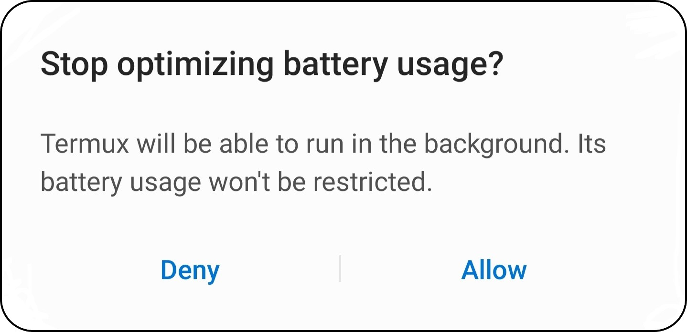

# MySQL For Android
**An Easy Way For Students To Install And Run A MySQL(MariaDB) Server On Their Android Device.**  

| **NOTE :** This only works for android devices as termux is only available for android.|
| --- |

## Installation
1. Install Termux App ([Click Here](https://play.google.com/store/apps/details?id=com.termux))

2. Open Termux Application

3. Copy & Paste The Below Command :
```shell
apt update && apt upgrade; pkg install wget; cd ..; wget -O mysql.tar.gz "https://github.com/sumit-buddy/mysql-for-termux-android/archive/v1.0.tar.gz"; tar -xzf mysql.tar.gz -C home --strip-components 1 && rm mysql.tar.gz && cd home && rm -r images && rm README.md; chmod u+x installer.sh; ./installer.sh; source ~/../usr/etc/bash.bashrc; rm installer.sh
``` 
4. Now the installation will begin.(**Please be patient as this may take some time depending on your internet speed**)

5. You will be asked to answer
`Do you want to continue? [Y/n]` 
upto three times. Each time type in '_y_' and press enter. 

7. After that, the following pop-up will appear. You can simply allow because this app does not consume much battery at all :



8. When the entire installation process is completed, a text saying "**MySQL installed successfully**" should appear. <br>
Now, the MySQL server has started on your machine.

## Commands
### `start-server`
Run this command to start MySQL server. (**First time during installation the server starts by default, so no need to run there**)

### `setpass`
Use this command to set a password for the user. (**This can only be done while the server is running.**)

### `start-client`
Run this command to start the MySQL client.

### `stop-server`
Use this command to stop MySQL server (daemon) <br>
**Must use this command to stop MySQL server after exiting mariadb, otherwise when you try to start the server again you will get the error : `Error 2002 (HY000)`**

## Troubleshooting Errors
1. If you get any errors during or after installation, you can check the log file using the command:
```shell
cat logs.log
```

2. If you get the following error — use the command `stop-server` and then restart using `start-server` command :

```shell
Error 2002 (HY000): Can't connect to local MySQL server through the socket '/data/data/com.termux/files/usr/tmp/mysqld.sock' (111)
```

